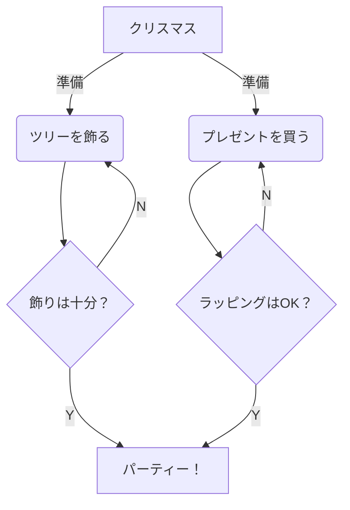

### mermaid

```mermaid
graph TD
    A[クリスマス] -->|準備| B(ツリーを飾る)
    A -->|準備| C(プレゼントを買う)
    B --> D{飾りは十分？}
    C --> E{ラッピングはOK？}
    D -- Y --> F[パーティー！]
    E -- Y --> F
    D -- N --> B
    E -- N --> C
```
